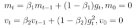
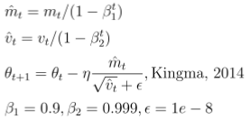
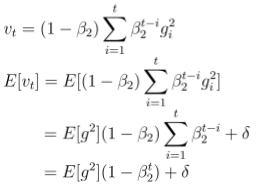

# Optimization-Algorithms

In my recent works, I find some interesting problems about Adam optimizer in sparse cases.
To get a deeper understanding, I read this [overview blog](http://ruder.io/optimizing-gradient-descent/index.html) and corresponding papers and give a presentation about optimization algorithms in APEX Lab with the help of ``@Guoxin Sui``.
I want to summarize and share my understandings and confusions about these brilliant works in this repository.
The first section will update recent studies going deeper in this direction, and the second section will introduce the basic compenents included in the [PPT](qu_optimizer.pdf).

## Recent Studies (TODO)

### The Marginal Value of Adaptive Gradient Methods in Machine Learning, Ashia C. Wilson, et.al. 2017

This paper summarize the updating behaviors of non-adaptive and adaptive methods. 
The author constructs a simple convex problem where non-adaptive methods work while adaptive methods fail. This problem illustrates the overfitting problem of adaptive methods, which means the generalization ability of adaptive methods may be worse than non-adaptive ones.
The author also conducts experiments on deep learning problems, including computer vision, natural language modeling and parsing. All the experiments show adaptive algorithms are no better than non-adaptive ones. 

This paper concludes in 2 aspects:
- Adaptive method is not a free lunch, and still needs careful tuning.
- Non-adaptive method with carefully designed decaying schedule can have good performance.

## Basic Algorithms (Included in PPT)
This section goes through 2nd order optimization at first to briefly explain ``step size estimation``, and then goes through 1st order optimization which is much more popular in deep learning and other applications involving neural networks. 

### 1st order optimization: 
- The gradient tells us whether the objective is descreasing or increasing at a point, which approximates ``a tangent line`` on the error surface. 
- A gradient is represented by a ``Jacobian`` Matrix. 
- The most typical algorithm is ``Gradient Descent``, which updates paramaeters along the steepest descent direction 

where \\(\theta\\) denotes the parameter set, \\(\eta\\) denotes the step size, and \\(J\\) represents the objective function.

### 2nd order optimization: 
- Use the 2nd order derivative to optimize the objective, which provides a ``quadratic surface`` touching the curvature of the error surface. 
- The 2nd order gradient is represented by a ``Hessian`` Matrix. 
- The most typical algorithm is ``Newton Method``, which estimates a sequence of optima through quadratic curves and gets rid of the step size. ``Newton Method`` can be derived from Tylor Expansion. 

Take derivative and set as 0 to estimate the optimum, we get the next estimation of optimum 

where \\(\eta\\) is replaced by Hassian inverse, be careful that Hassian inverse may change direction.

### Newton Method 
Newton method guarantees convergence when: (i) \\(\theta_0\\) is close to \\(\theta^*\\), (ii) Hessian of \\(\theta^*\\) is not singular, (iii) Hessian around \\(\theta^*\\) is k-Lipschitz continuous:

when \\(\frac{k}{\lambda_{min}} < 1\\).

### Quasi-Newton Method
Because Hessian is difficult to compute, Quasi-Newton methods construct a positive definite symmetric matrix to approximate Hassian (or inverse Hessian) instead according to Quasi-Newton condition 

thus we can construct \\(B\\) and \\(D\\) matrix via parameter change and gradient change, this leads to Davindon-Fletcher-Powell algorithm (DFP, details in PPT), Broyden-Fletcher-Goldfarb-Shanno algorithm (BFGS, details in PPT), and Limited-memory BFGS (L-BFGS).

### Challenges of 2nd order optimization
- Complexity: GD \\(O(n)\\), Quasi-Newton \\(O(n^2)\\), Newton \\(O(n^3)\\), L-BFGS \\(O(kn)\\), where n is the amount of parameters
- (I found in [this Chinese post](https://www.zhihu.com/question/53218358) but not sure) Cramer-Rao bound states that generalization error cannot decrease faster than linear in strongly convex problems. From my understanding, 2nd order does not necessarily converge to better solution.
- Robustness: 2nd order methods always have numerical stability issues, etc.

### Challenges of 1st order optimization
- How to escape from local minima and saddle points
- How to decide learning rate (schedule)

Momentum-based algorithms are proposed to solve the 1st problem.
Adaptive learning rate algorithms are proposed to solve the 2nd problem.

### Momentum
``On the momentum term in gradient descent learning algorithms, Ning Qian, 1999``

Putting the learning rate \\(\eta\\) in eq.(1) or eq.(2) has no difference.
Momentum is proposed to accelerate training in plateaus, but it does not follow the gradient direction.
The potential cost of speed-up is performance, and this problem arises in other momentum-based algorithms, e.g., Nesterov, Adam.

### Nesterov Accelerated Gradient

Nesterov differs from momentum by replacing the last step gradient with a predicted gradient of the next step.
The prediction is more precise when the cumulated term is larger than the real gradient, as illustrated in [Hinton's lecture 6c](http://www.cs.toronto.edu/~tijmen/csc321/slides/lecture_slides_lec6.pdf).
Comparing to Momentum, Nesterov predicts a closer gradient of the next step, which approximates the local curvature better and converges faster than momentum.
[This Chinese post](https://zhuanlan.zhihu.com/p/22810533) shows the equivalence of Momentum and Nesterov.

### Adagrad

``Adaptive Subgradient Methods for Online Learning and Stochastic Optimization, John Duchi, et. al. 2011``

Different from Momentum and Nesterov, Adagrad is an adaptive algorithm because it estimates learning rates for different parameters using L2 norm of gradient sequence. This idea comes from the generalization of Gradient Descent to Mahalanobis space, which is formed by historical gradients.

Adagrad is a very important adaptive algorithm and can adjust to features with different frequency. However, the cumulated sum may result in too early stop in training even though reasonable gradients are provided.

### Adadelta

``Adaldelta: An Adaptive Learning Rate Method, Matthew D. Zeiler, 2012``

Adadelta improves Adagrad by replacing the sum of squared gradients with the expectation, for simplicity, Adadelta uses an exponentially decaying average of the squared gradients

where \\(\epsilon\\) is a small number for numerical stability.
The exponentially decaying average can also be regarded as the discounted sum in a sliding window, which can avoid the infinite sum of Adagrad and reflect local training dynamics. Adadelta also considers the weakness of Adagrad comes from the sensitivity to learning rate. Thus Adadelta further replaces the constant learning rate term with an estimated step size.

The author explains this idea with ``unit correction``, a very relevant work is ``No more pesky learning rates, T. Schaul, S. Zhang, and Y. LeCun, 2012``, where the windowed expectations are incorporating the diagonal Hessian to better estimate Hessian.

I think Adadelta does not provide sufficient proof of its step size estimation and ``unit correction`` is too simple to generalize to other cases. Besides, the author regards the windowed sum and the expectation as the same, but they are slightly different actually. This is because of the 0 initialization of the expectation, which yields a biased estimation in the early stage of training.

### RMSProp

RMSProp is introduced in [Hinton's lecture 6e](http://www.cs.toronto.edu/~tijmen/csc321/slides/lecture_slides_lec6.pdf), and is a simpler version of Adadelta.

where \\(\gamma = 0.9\\), \\(\eta = 0.001\\) is the default setting.
RMSProp is also popular in practice, a possible reason is that RMSProp is simpler, another possible reason is that the step size estimation of Adadelta does not always work well.

### Adam

``Adam: A Method for Stochastic Optimization, Diederick P. Kingma and Jimmy Lei Ba, 2015``

Adam is related to Adagrad and RMSProp, and it belongs to momentum methods. Adam estimates the 1st and the 2nd moments with bias correction.

where the biased estimation problem also happend in Adadelta

this problem is shown in the PPT.

The author proves Adam convergence in a convex online learning framework ``Online convex programming and generalized infinitesimal gradient ascent, Zinkevich, Martin, 2003``, proving adam has regret bound \\(O(\sqrt{T})\\). However, the algorithm in this proof is slightly modified in 3 ways:

- the learning rate decays with \\(\sqrt{1/t}\\)
- the 1st moment decaying parameter also decays along training
- the constant \\(\epsilon\\) is neglected

For the first two changes, I still do not know their effects. In my previous works, I find the real gradient could be extremely small when using cross entropy loss (where the logit gradient is bounded in (-1,1)). Thus \\(\epsilon\\) could be critical, especially in unbalanced problems.

AdaMax is a variant of adam replacing 2nd moment with infinite noment.
Nadam is another variant of adam using Nesterov acceleration.